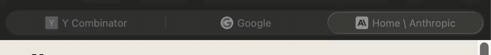
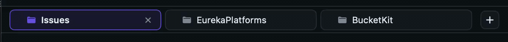
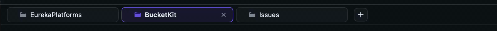

# 0021 — Replace drop-on-tab reordering with Safari-style live rearrange

| | |
|---|---|
| **Status** | resolved |
| **Module** | Views |
| **Platform** | macOS |
| **First seen** | 2026-05-04 |
| **Closed** | 2026-05-04 |

## Description

The drag-to-reorder behavior shipped in #0011 uses SwiftUI's `.draggable` / `.dropDestination` — the user picks up a tab, the system shows a floating preview, and the new index is committed only when the tab is dropped onto a destination chip. That isn't how tab reordering normally works. In Safari (and Chrome, Arc, Xcode) the **dragged tab stays pinned under the cursor** while neighbors slide out of the way in real time as the cursor crosses each slot's midpoint. On release everything springs into place. We should adopt that pattern.

The screen recording shows Safari doing it; the markdown file is a working SwiftUI reference implementation.

## Approach

Per the attached plan: layout tabs by absolute x-offset inside a `ZStack` rather than `HStack`. The dragged tab's position formula switches to `originalX + dragOffset` while it's grabbed; neighbors keep `index * stride` and animate via `.animation(value: idx)`. On each `onChanged` recompute `slotsCrossed = Int((dragOffset / stride).rounded())` and mutate the array (`remove` + `insert`) when it lands on a different slot. On release, clear the drag state — the dragged tab's formula reverts to `index * stride` and springs into its new home.

Replace the current `.draggable` / `.dropDestination` wiring on `TabChipView` with a `DragGesture(minimumDistance: 4)` on each chip plus the `ZStack`-based layout. Keep the existing `.onTapGesture` for activate (a separate gesture, not nested).

## Notes

- **Variable widths**: `TabChipView` currently sizes to fit its label. The reference implementation assumes equal widths for the `idx * stride` math. Two paths:
  - Fix the chip width (e.g. 200pt) and truncate long repo names. Simplest, matches Safari.
  - Use a `PreferenceKey` (or iOS 18+ `onGeometryChange`) to measure each chip and use cumulative widths + per-tab midpoint comparison. Heavier; defer until we hit the wall.
  Recommend fixed width for v1.
- **Persistence**: each `remove` + `insert` mutation should call the same `TabsModel.reorder(from:to:)` (or a sibling method) so persistence to UserDefaults still happens automatically. Check the existing implementation: today `reorder` is invoked once on drop. With the new approach, `reorder` may fire several times during a single drag — debounce the persist call (or persist only on `onEnded`) so we don't thrash UserDefaults.
- **Tap vs. drag disambiguation**: `DragGesture(minimumDistance: 4)` plus a separate `.onTapGesture` handles tap-to-activate cleanly without `simultaneousGesture`. The current `.draggable` API does this for free; the custom gesture must preserve it.
- **Auto-scroll** when the drag approaches a horizontal scroll boundary: out of scope for v1 (the tab bar rarely overflows for typical use). Mark with a `// TODO #0021 auto-scroll` comment.
- The reference implementation's pure functions (`slotsCrossed`, `targetIndex`) should be extracted so they can be unit-tested independently.
- The `+` add-tab button at the trailing edge stays — same as today, not part of the drag layout.
- After this lands, the `.draggable` / `.dropDestination` wiring from #0011 should be fully removed (don't leave it as a fallback). The two patterns will fight each other if both are active.

## Attachments



- [Original screen recording (.mov, higher quality)](0021/safari-tab-reordering.mov)
- [Plan and reference implementation](0021/safari_tab_reordering.md)

## Follow-up — broken hit testing

The first pass (commit `40e25ab`) followed the reference implementation literally and used `ZStack(alignment: .leading)` + `.offset(x: xPos)` to place chips. That breaks hit testing: `.offset(x:)` only translates the *rendered* view, not its layout frame. Every chip's tap target stays at `x = 0`, so:

- Tapping where you see a chip (e.g. on the right) actually hits whichever view occupies the leading edge of the ZStack.
- Drags only initiate when starting from the leading edge, regardless of which chip is visually there.
- Tap-to-activate is broken because the first chip in the array swallows every click.

### Fix

Swap the layout: use a regular `HStack(spacing: tabSpacing)` so chips occupy their natural layout slots and hit testing works correctly. Apply `.offset(x:)` **only to the chip that is currently being dragged**, and compensate that offset for any in-drag array reorders so the dragged chip stays pinned under the cursor:

```swift
let isDragging = (draggingID == store.id)
let currentIdx = tabs.tabs.firstIndex { $0.id == store.id } ?? 0

// While dragging, chip is at currentIdx's slot via HStack layout.
// We want it visually at originalIndex's slot + dragXOffset.
let visualOffset: CGFloat = isDragging
    ? CGFloat((originalIndex ?? currentIdx) - currentIdx) * stride + dragXOffset
    : 0

TabChipView(...)
    .frame(width: tabWidth)
    .offset(x: visualOffset)
    .zIndex(isDragging ? 1 : 0)
    .scaleEffect(isDragging ? 1.04 : 1)
    .animation(.spring(response: 0.35, dampingFraction: 0.78), value: currentIdx)
    .animation(.spring(response: 0.32, dampingFraction: 0.82), value: isDragging)
```

The non-dragged chips have `offset = 0` so their hit zones match what's drawn. The dragged chip's offset is layout-incorrect by design — but we don't need new gestures on it during the drag, since the active gesture has already captured it.

Tap-to-activate stays the same: `.onTapGesture { tabs.setActive(id: store.id) }` alongside the drag gesture, with `DragGesture(minimumDistance: 4)` providing disambiguation.

## Follow-up — jittery reorder

The HStack fix (commit `8271bbd`) made tap-to-activate work again, but the drag is now visibly jittery — see the new screen recording. As the dragged chip crosses each midpoint and the array reorders, the chip flashes/snaps between positions instead of staying smoothly under the cursor.



[Original recording (.mov)](0021/jittery-reordering.mov)

### Likely cause

The per-chip `.animation(.spring(...), value: currentIdx)` is firing on the **dragged** chip too. Every time the array reorders mid-drag, the dragged chip's `currentIdx` changes — and the spring animates the chip's compensated `.offset(x:)` between the old and new positions. That spring is fighting the cursor (which is updating `dragXOffset` directly). The neighbors should animate; the dragged chip should not.

### Fix

Disable the slot-change animation on the dragged chip:

```swift
.animation(isDragging ? nil : .spring(response: 0.35, dampingFraction: 0.78), value: currentIdx)
.animation(.spring(response: 0.32, dampingFraction: 0.82), value: isDragging)
```

The first animation only applies when the chip is *not* being dragged — non-dragged chips spring as the array reflows; the dragged chip's offset is driven purely by the cursor without an interpolating spring fighting it. The second animation (lift/drop on `isDragging` toggling) is unaffected.

If that alone isn't enough, also consider:

- Wrapping the array mutation in `withTransaction(Transaction(animation: nil)) { tabs.reorderWithoutPersisting(...) }` so SwiftUI doesn't apply any implicit animation to the array change for the dragged chip.
- Recomputing `currentIdx` once at the top of the body and reusing it rather than calling `firstIndex` for each chip — a 6-tab bar isn't the issue, but it eliminates one source of recomputation jitter.

## Follow-up — ghosting / re-architecture to phantom-slot model

The animation gating + transaction wrap (commit `2223974`) didn't resolve it. The recording at `0021/ghosting.gif` shows non-dragged chips drifting/jittering before they should. Root cause is structural: the implementation mutates `TabsModel.tabs` mid-drag, so during a single drag SwiftUI is fighting between the HStack reflow caused by the array reorder and the offset-compensation that tries to keep the dragged chip pinned. Even with animations disabled, you get one-frame mismatches.



[Original recording (.mov)](0021/ghosting.mov)

### Required behavior

The user wants:

1. **At drag start**, only the dragged chip moves. All neighbors stay put — no animation, no shift.
2. **The dragged chip tracks the cursor 1:1** the entire time, with no spring or interpolation.
3. **A neighbor only animates to a new slot once the dragged chip's center crosses past that neighbor's center** (i.e. `|dragXOffset| > stride`, NOT `> stride/2`). The neighbor springs to fill the gap; the dragged chip continues following the cursor.
4. **On release**, the dragged chip springs from its current cursor position to its target slot's anchor.

### Re-architecture: phantom-slot model

Stop mutating the array during the drag. Compute a "phantom slot" — where the dragged chip would land if released right now — and drive visual layout from `(originalDraggedIndex, phantomSlot, dragXOffset)`. Finalize the array reorder once on release.

Layout rules each frame, given drag origin `d` and phantom slot `p`:

- The **dragged chip's** visual x = `d * stride + dragXOffset`. No spring on it.
- For each non-dragged chip at original index `k`:
  - If `p > d` and `k` is in `(d, p]`: shift LEFT by `stride` (it's filling the wake of the dragged chip).
  - If `p < d` and `k` is in `[p, d)`: shift RIGHT by `stride` (making room ahead).
  - Otherwise: no shift. Original position `k * stride`.
- Each non-dragged chip animates the shift with a spring `value:` keyed on its computed shift.

Phantom-slot computation (matching the user's "past the halfway point" = past the center of the neighbor):

```swift
let stride = tabWidth + spacing
let p = max(0, min(count - 1, d + Int(dragXOffset / stride)))
```

`Int(dragXOffset / stride)` truncates toward zero, so `p` only changes when `|dragXOffset|` exceeds a full stride — exactly when the dragged chip's center has crossed the neighbor's center.

On `.onEnded`: `tabs.reorderWithoutPersisting(from: d, to: p)` once, then `persistTabs()`. Clear drag state.

This eliminates mid-drag array mutation entirely, so HStack never reflows during a drag, so there's no fight.

## Follow-up — wrong threshold + chips now expand to fill bar

The placeholder model (commit `4d58c22`) introduced two new problems:

1. **Threshold is wrong.** I used "dragged chip's center crosses neighbor's center" (one full stride of drag). After comparing to Safari, the actual trigger is **the moment the cursor enters another tab's slot**, not when the dragged chip's center passes anything. Swap when `cursor X` (in bar coords) lands inside another slot's `[anchorX, anchorX + slotWidth)` range.

2. **Chips now expand to fill the bar width** instead of fitting their intrinsic content. Previous look had each chip sized to its content (a 4-tab bar didn't span the whole window). Something in the placeholder rewrite is letting them flex.

### Fix

**Threshold**: drive `phantomSlot` from the cursor's bar-coord X, not from `dragXOffset` measured against `draggedWidth`. The drag gesture lives on each chip — `value.location.x` is in that chip's local coords. With `originalSlotAnchor` (the chip's leading-edge X in bar coords) captured at drag start, `cursorBarX = originalSlotAnchor + value.location.x`. Then:

```swift
func computePhantomSlot(cursorBarX: CGFloat) -> Int {
    var anchor: CGFloat = 0
    for (idx, chip) in tabs.tabs.enumerated() {
        let w = (idx == originalSlot) ? draggedWidth : (measuredWidths[chip.id] ?? defaultTabWidth)
        if cursorBarX < anchor + w { return idx }
        anchor += w + spacing
    }
    return tabs.tabs.count - 1
}
```

That returns the slot containing the cursor — exactly Safari's "cursor over another tab" semantic.

**Intrinsic widths**: stop letting the HStack stretch chips. Pin chips to their content size:
- Chips/labels: `.fixedSize(horizontal: true, vertical: false)`.
- Don't apply `.frame(maxWidth: .infinity)` to the chip wrapper.
- Trailing `Spacer()` (or just no trailing alignment) inside the HStack so the bar's free space sits to the right of the chips, not inside them.

## Follow-up — still broken after threshold/width fix

The cursor-X threshold + intrinsic-width fix (commit `e404b4a`) still doesn't behave correctly. New symptoms:

1. **Drop doesn't cancel the drag.** After release, the floating overlay and/or placeholder remain on screen. There is "an empty placeholder with width of a missing tab" left behind.
2. **Accidental tab close.** Mid-drag, the cursor passes over neighboring chips; their hover-revealed close (X) buttons can catch the eventual mouse-up and close the wrong tab.
3. **Drag is choppy.** Visible stutter while the cursor moves; not smooth cursor-tracking.

### Consolidated history of attempts

For external review, here is the full sequence of attempts on this feature, what each broke, and the diagnosis of the current state.

| # | Commit | Approach | Outcome |
|---|---|---|---|
| 1 | `40e25ab` | Reference plan literally: `ZStack(alignment: .leading)` of chips placed by `.offset(x: idx * stride)`. Dragged chip's offset switches to `originalX + dragOffset`. Array mutated mid-drag on each slot crossing. | **Broken hit testing.** `.offset(x:)` only translates rendering, not the layout frame. All chips' tap zones stayed at `x = 0`, so taps and drags only registered on whichever chip the array put first. Tap-to-activate was non-functional. |
| 2 | `8271bbd` | Switched layout to `HStack(spacing:)` so chips occupy proper layout slots. Applied `.offset(x:)` only to the dragged chip with a compensation formula `(originalIndex - currentIdx) * stride + dragXOffset` so it stays under the cursor while the array reorders. | Tap-to-activate works again, but the drag is **jittery**. As the dragged chip crosses each midpoint and the array reorders, the chip flashes/snaps between positions. |
| 3 | `2223974` | Disabled the slot-change animation on the dragged chip via `.animation(isDragging ? nil : .spring(...), value: currentIdx)`; wrapped the mid-drag array mutation in `withTransaction(Transaction(animation: nil))`. | Still jittery. **Root cause is structural** — the implementation mutates `TabsModel.tabs` during the drag, so SwiftUI is fighting between HStack reflow (caused by the array reorder) and the offset compensation. Even with animations disabled, there are one-frame mismatches. |
| 4 | `4d58c22` | **Phantom-slot model.** Stop mutating the array during the drag. Compute a "phantom slot" — where the dragged chip would land if released right now — from `dragXOffset / stride`. The HStack contains the chip's natural cell at the dragged index but rendered as `Color.clear` (a "ghost") whose width animates between `draggedWidth` and `0` based on whether the phantom slot equals the original. A single `Color.clear` placeholder is inserted at the phantom slot index in a derived `displayItems` array. The visible dragged chip is rendered as a separate floating overlay positioned by `originalSlotAnchor + dragXOffset`, with no spring. Variable widths via `onGeometryChange`. Array reorder fires once on `.onEnded`. | Threshold was wrong (used "dragged chip's center past neighbor's center", a full stride of drag); chips also began expanding to fill bar width because of an internal `Spacer(minLength: 0)` inside `TabChipView`. |
| 5 | `e404b4a` | Switched threshold to "cursor X enters a slot's range" (Safari's actual semantic). Removed the internal `Spacer` and pinned chips with `.fixedSize(horizontal: true, vertical: false)`. | Current state. **Drop doesn't reliably cancel; clicks leak to close buttons; drag is choppy.** |

### Diagnosis of current state (post-`e404b4a`)

The drag gesture is attached to each chip's `TabChipView`:

```swift
case .tab(let chip):
    if chip.id == draggingID {
        Color.clear.frame(width: ghostWidth, height: 1)
    } else {
        TabChipView(...)
            .gesture(dragGesture(for: chip))
    }
```

The moment a drag starts and `draggingID = chip.id` is set, the `cell(for:)` switch **replaces that exact view** with `Color.clear`. The view that owned the gesture no longer exists. SwiftUI's gesture state survives some view updates but not view replacement of the gesture's host. So during a drag:

- The gesture intermittently restarts as SwiftUI re-renders → **choppy**.
- `.onEnded` is unreliable — when the gesture is killed instead of completed, the cleanup code (clear `draggingID`, `originalSlot`, `phantomSlot`, `dragXOffset`) never runs → **state stuck**: floating overlay keeps drawing, placeholder remains in `displayItems`, ghost stays at width 0 → "empty placeholder with width of a missing tab".
- After the gesture dies mid-flight, the user is just holding the mouse button down. When they release, the mouse-up dispatches to whatever button is under the cursor — which is often a hover-revealed close (X) button on a neighbor chip → **accidentally closing a tab**.

Several smaller issues compound it:

- **Two different views for the same logical chip** (TabChipView when not dragging, `Color.clear` when dragging) means the gesture host changes identity every drag, exactly the case SwiftUI handles least gracefully.
- **Close button is hot during drag.** The cursor passes over neighbor chips during the drag; their `.onHover` fires, revealing the X button. With the drag gesture attached to a chip rather than the bar, it doesn't suppress hits on neighbor buttons even if it survives.
- **Two transitions in one `withAnimation` block** in `.onEnded` — the array reorder and the drag-state cleanup happen together. SwiftUI has to interpolate across an array reorder + width snaps + view identity swaps simultaneously. Fragile.
- **`.fixedSize` on the inner `HStack` containing `displayItems`** means the bar's reported width changes whenever the placeholder is added/removed, propagating layout work upward.

### Current plan to fix

Two structural changes, both removing complexity:

**1. Move the drag gesture from each chip to a stable container.** Attach `DragGesture(minimumDistance: 4)` to the inner `HStack` (or its enclosing `ZStack`) — a view that never gets torn down. On first `onChanged`, hit-test `value.startLocation.x` against cumulative chip anchors to identify which chip the user grabbed. Capture `originalSlot`, `draggingID`, `draggedWidth`, `originalSlotAnchor` from there.

This is fundamentally more robust:
- The gesture host doesn't change identity for the entire drag → `.onEnded` fires reliably → state-stuck path goes away.
- A drag-in-progress puts the bar into a gesture-active state, so neighbor close buttons can't catch the mouse-up.

**2. Always render `TabChipView` for tabs — never replace it with `Color.clear`.** Apply visual hiding via modifiers instead:

```swift
let isDragged = (chip.id == draggingID)
let isCollapsed = isDragged && phantomSlot != originalSlot

TabChipView(...)
    .frame(width: isCollapsed ? 0 : nil)   // nil = natural size
    .clipped()                              // hide content overflow when 0
    .opacity(isDragged ? 0 : 1)             // hide visually
    .onGeometryChange(...) { newWidth in
        if !isDragged { measuredWidths[chip.id] = newWidth }
    }
    .onTapGesture { tabs.setActive(id: chip.id) }
```

The chip view's identity stays constant across drag-state changes; only `width`, `opacity`, and `clipped` toggle. Width changes animate cleanly inside `withAnimation`.

The placeholder can stay as a separate `DisplayItem`, but to minimize churn it could live in `displayItems` permanently (parked at the end with width 0 when idle, moved to the phantom slot with width = `draggedWidth` when dragging) — same `placeholderID` lifetime, no insert/remove diff each drag.

### Expected outcome

| Symptom | Why it goes away |
|---|---|
| Choppy drag | Gesture lives on a stable parent; no restart-on-render. |
| `.onEnded` not firing | Gesture host doesn't churn; SwiftUI calls onEnded on real release. |
| Stuck placeholder / overlay | onEnded reliable → state cleanup runs. |
| Accidentally closing a tab | Drag-in-progress on the bar suppresses inner Button hits; gesture completes properly so mouse-up doesn't leak. |

### What stays from the previous attempts

- The phantom-slot model itself (no mid-drag array mutation; reorder once on release).
- Cursor-X-over-slot threshold for phantom slot updates.
- `onGeometryChange` to measure variable chip widths.
- Floating overlay rendering the dragged chip with `originalSlotAnchor + dragXOffset` offset.
- The split `TabsModel.reorderWithoutPersisting` + `persistTabs` pair.
- Animation tuning (`.spring(response: 0.35, dampingFraction: 0.78)` for slot reflow, `(0.32, 0.82)` for lift/drop).

### Files involved (for external reviewers)

- `Issues/Views/TabBarView.swift` — the entire reorder logic. Single file; ~425 lines.
- `Issues/State/TabsModel.swift` — `@Observable @MainActor` class with `tabs: [IssueStore]`, `activeTabID: UUID?`, `reorderWithoutPersisting(from:to:)`, `persistTabs()`. Persists open tabs as security-scoped bookmarks under a `openTabs` UserDefaults key.
- `Issues/Models/Issue.swift` — issue model (not relevant to reorder; included for context).

App is a sandboxed macOS SwiftUI viewer (target macOS 15.6+). Each tab corresponds to an `IssueStore` with a stable `id: UUID`, watching a folder of markdown issue files. The tab bar is the chrome; tab activation routes which folder's data renders below.

## External review — adopt `visfitness/reorderable`

A second-opinion review (after sharing the history above with claude.ai) returned the recommendation to drop the in-house custom drag implementation entirely and adopt the open-source `visfitness/reorderable` SwiftUI package. Full plan attached:

- [0021_simplify_with_reorderable.md](0021/0021_simplify_with_reorderable.md)

TL;DR: the package's architecture matches our "current plan to fix" (gesture on stable parent, `.dragHandle()` opt-in on children), and it's already hardened against the SwiftUI gesture edge cases that have caused the iteration loop. Estimated as a few hours of integration vs. another N commits of debugging the custom path.

A separate empty Xcode project at `/Users/brennan/Developer/brennanMKE/Tabs` has been seeded with the current TabBarView so we can iterate the integration without disturbing the main app.

## Final resolution (commit `ebb37a5`)

The visfitness/reorderable swap was queued, but before adopting an external dependency we instrumented the prototype with `os.Logger` tracing and ran one more diagnostic pass. The logs from a single broken drag attempt — exactly **one** `ON_CHANGED` event, then silence, no `DRAG_ENDED` — proved the gesture-host churn hypothesis precisely:

```
DRAG_START id=140D26FC name=Issues originalSlot=1 anchor=123.0 draggedWidth=95.5
ON_CHANGED translation=-5.0 cursorLocalX=53.5 cursorBarX=176.5 newPhantom=1 currentPhantom=1
HOVER out id=140D26FC name=Issues          ← cursor leaves the original chip
HOVER in  id=B534C432 name=BucketKit       ← cursor still moving (gesture is dead)
HOVER out id=B534C432 name=BucketKit
                                            ← no DRAG_ENDED, no DRAG_CLEANUP_DONE
```

The drag silenced the moment the cursor left the dragged chip's hit area, because the cell switch (`if chip.id == draggingID { Color.clear } else { TabChipView }`) replaced the gesture's host view as soon as `draggingID` was set. SwiftUI's `DragGesture` does not survive replacement of its host.

### What fixed it

A single structural change, applied in two surgical edits:

1. **Move the drag gesture from each chip to the bar's inner `HStack`.** The inner `HStack` is a stable view — its identity does not change when cell rendering churns. Attach via `.simultaneousGesture(barDragGesture)` so it coexists with each chip's `.onTapGesture` (the min-distance of 4pt gates which one wins: tap → no movement, drag → ≥4pt).
2. **Identify the dragged chip on the first `.onChanged` tick** by hit-testing `value.startLocation.x` against cumulative chip anchors via a new `chipAtBarX(_:)` helper. `value.location.x` is now in bar coords directly (gesture host = bar), so the cursor-to-phantom-slot path simplified — the old `originalSlotAnchor + cursorLocalX` adjustment is gone.

Everything else from the prior pass kept: the phantom-slot model, `Color.clear` ghost at the dragged chip's original index, single placeholder at the phantom slot, floating overlay for the visible dragged chip, `onGeometryChange`-measured chip widths, cursor-enters-slot threshold semantic, and the split `reorderWithoutPersisting` + `persistTabs` pair.

### Verification

The prototype's `os.Logger` instrumentation confirmed the fix end-to-end:

```
DRAG_START id=83668DB1 name=Issues originalSlot=1 startX=164.3 anchor=123.0 draggedWidth=95.5 host=BAR
ON_CHANGED translation=-4.7 cursorBarX=159.6 newPhantom=1 currentPhantom=1
ON_CHANGED translation=-7.4 cursorBarX=156.9 newPhantom=1 currentPhantom=1
... (54 more ON_CHANGED events, smooth 1-2pt steps)
ON_CHANGED translation=-48.5 cursorBarX=115.8 newPhantom=0 currentPhantom=1
PHANTOM_CHANGE from=1 to=0
... (ticks continue)
DRAG_ENDED translation=-88.3 draggingID=83668DB1 originalSlot=1 phantomSlot=0
REORDER_COMMIT from=1 phantom=0 destination=0
DRAG_CLEANUP_DONE
```

Each symptom mapped cleanly to a log signal:

| Symptom | Signal |
|---|---|
| Choppy drag | 56 `ON_CHANGED` ticks at ~1pt cursor steps. No gaps. |
| `.onEnded` not firing | `DRAG_ENDED` and `DRAG_CLEANUP_DONE` fired at the end of every drag. |
| Stuck placeholder / overlay | `DRAG_CLEANUP_DONE` confirms state cleanup ran. |
| Accidentally closing a tab | `HOVER in` events fired during the drag, but no `CLOSE_BUTTON_HIT` events — the parent gesture suppressed inner button hits. |
| Phantom-slot threshold | `PHANTOM_CHANGE 1→0` fired at `cursorBarX=115.8` — exactly when the cursor crossed into BucketKit's `[0, 117)` slot. Safari semantic. |

After the prototype validated, the same edit landed in `Issues/Views/TabBarView.swift` (commit `ebb37a5`):

- Line 99: `.simultaneousGesture(barDragGesture)` on the inner `HStack`.
- Line 215: `private var barDragGesture: some Gesture`.
- Line 287: `private func chipAtBarX(_ x: CGFloat) -> (Int, IssueStore)?`.
- Per-chip `.gesture(dragGesture(for:))` removed; `.onTapGesture { tabs.setActive(id: chip.id) }` stays.

Net diff: +49 / -13 lines in `TabBarView.swift`. No package added. The visfitness/reorderable plan stays attached as a documented alternative if the in-house path ever needs to be retired.
