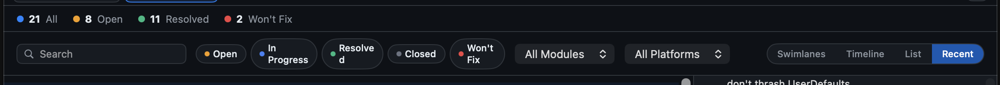

# 0022 — Header / toolbar layout overhaul to stop squeezing components

| | |
|---|---|
| **Status** | resolved |
| **Module** | Views |
| **Platform** | macOS |
| **First seen** | 2026-05-04 |
| **Closed** | 2026-05-04 |

## Description

The toolbar row is over-packed. At normal window widths the status pills wrap awkwardly ("In Progress" stacks on two lines, "Resolved" gets a hyphen-break, etc.), and the search field added in #0007 is competing with the status pills, module/platform pickers, and view-mode buttons for horizontal space. Reorganize the header and toolbar to spread these components across two rows that don't fight each other.

## Layout changes

1. **Top-left of the header**: replace the `"Issues"` text title with the app icon (small, ~22pt). The accent-blue "Issues" word is decorative — the app name is on the menu bar already.
2. **Top-right of the header**: remove the long folder path string. Put the **search field** there instead — it's a high-frequency control and the header has the room.
3. **Stats bar (right side)**: move the view-mode segmented control (`Swimlanes` / `Timeline` / `List` / `Recent`) onto the same row as the colored count chips. Stats on the leading edge, view-mode trailing — they don't fight each other since stats text is short.
4. **Status pills**: prevent label wrapping. Each pill ("Open", "In Progress", "Resolved", "Closed", "Won't Fix") should render its label on a single line and the pill should size to fit. Apply `.fixedSize(horizontal: true, vertical: false)` and/or `.lineLimit(1)` to the pill content. The pills can horizontally scroll or compress as a group, but never split a label across lines.
5. **Tab hover tooltip**: each `TabChipView` should show the full folder path in its `.help(...)` tooltip when hovered. Today the chip shows only the repo name (the folder's parent's `lastPathComponent`); on hover the user wants to confirm which folder is bound to that tab.

## Resulting structure

```
[icon]                                                  [Search …………]   <- header
21 All · 8 Open · 11 Resolved · 2 Won't Fix    [Swimlanes Timeline List Recent]   <- stats bar
[Open] [In Progress] [Resolved] [Closed] [Won't Fix]  [All Modules ▾]  [All Platforms ▾]   <- toolbar
```

The toolbar row keeps status pills + module/platform pickers; with search and view-mode lifted out, there's enough room that nothing wraps.

## Attachments



## Notes

- Touch points: `Issues/Views/HeaderView.swift` (icon + search), `Issues/Views/StatsBarView.swift` (add view-mode trailing), `Issues/Views/ToolbarView.swift` (remove search field, fix pill label wrapping; remove view-mode segment), `Issues/Views/TabBarView.swift` (add `.help(folderURL.path)`).
- The search field's `@FocusState` and Cmd+F wiring (registered with `AppCommandsController.focusSearch` in #0007) should move to the new home cleanly — the controller closure pattern is location-agnostic.
- App icon: use `Image("AppIcon")` if the asset catalog exposes it as a regular image, or render the icon from the bundle (`NSImage(named: NSImage.applicationIconName)` bridged into a SwiftUI `Image`). Confirm which works in `Assets.xcassets`.
- Since the path text on the right is gone, expose the same info via the tab tooltip (item 5) so the user doesn't lose the ability to confirm a folder.
- Remove anything that becomes truly redundant after the move (e.g. the existing path label component) — don't leave stub views around.
