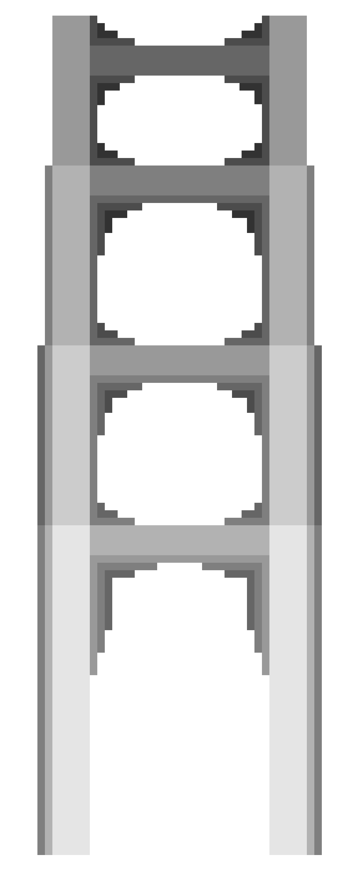

# 0028 — Drop redundant header row; promote tabs to the top and move search next to view-mode

| | |
|---|---|
| **Status** | resolved |
| **Module** | Views |
| **Platform** | macOS |
| **First seen** | 2026-05-04 |
| **Closed** | 2026-05-04 |

## Description

The current top row of the app shows the app icon plus a large purple "Issues" wordmark on the leading edge and the search field on the trailing edge. The window's titlebar already says "Issues", and the macOS Dock and `Cmd+Tab` switcher already show the icon — the in-window header is redundant. Reclaiming that ~40pt of vertical space and reorganizing makes the chrome feel more like a real Mac app and less like a web page header.



## Proposed layout

Three rows instead of four:

```
[ Issues ✕ ]  [ BucketKit ]  [ EurekaPlatforms ]   [ + ]                                <- tab bar (was row 2, now row 1)
27 All  •  1 In Progress  •  21 Resolved  •  5 Won't Fix       [ Search …………… ]  [ Swimlanes Timeline List Recent ]   <- stats + search + view-mode (was row 3, now row 2; search moves here)
[ Open ]  [ In Progress ]  [ Resolved ]  [ Closed ]  [ Won't Fix ]   [ All Modules ▾ ]  [ All Platforms ▾ ]            <- toolbar (unchanged content; row 3)
```

What moves:

1. **Drop the entire current top row** — app icon + "Issues" wordmark + search field. The titlebar carries the app identity.
2. **Tabs move to the top row** — the `TabBarView` sits flush against the titlebar.
3. **Search field moves down to the stats-bar row**, immediately to the left of the view-mode capsule (`Swimlanes / Timeline / List / Recent`). Counts on the leading edge, then a `Spacer()`, then `[Search] [view-mode]` on the trailing edge.

Toolbar (status pills + module/platform pickers) is untouched.

## Notes

- File-wise this is `HeaderView.swift` deletion (or stripping it down to nothing and removing it from `MainView`'s vertical stack), `MainView.swift` rearrangement, and `StatsBarView.swift` getting the search field as a new trailing element. `ToolbarView.swift` doesn't change.
- The Cmd+F focus path goes through `AppCommandsController.focusSearch` (#0007) — the closure is registered from wherever the search field's `@FocusState` lives, so moving it from `HeaderView` to `StatsBarView` means relocating that `onAppear` registration. The controller pattern is location-agnostic; once the field's `onAppear` runs in its new home, Cmd+F still focuses it.
- The unseen-changes dot, hover-tooltip, drag-reorder, and right-click menu on tab chips all live on `TabBarView` and don't change with this move.
- The macOS titlebar has its own ~28pt height; the tab bar should sit immediately below with whatever vertical separator we want (a 1pt `appBorder` rule looks consistent with the existing stats/toolbar separators).
- Width math: at typical window sizes the search field gets ~240pt and the view-mode capsule ~280pt; the stats counts compress fine on the leading edge. At narrow widths the search may need a `.layoutPriority` so it doesn't get squeezed before the counts (or vice versa — try and see).
- Reuses #0022's intrinsic-width work (`.fixedSize(horizontal: true, vertical: false)` on chips and pills) so nothing should suddenly start expanding.

## Out of scope

- Custom titlebar accessories (e.g. embedding controls into the titlebar via `NSToolbar` / `.toolbar(removing:)`). The traffic lights stay where macOS puts them; we just don't duplicate the title underneath.
- Window-titlebar visibility tweaks. Standard window chrome is fine.
- A repo-name / path indicator inside the window (the active tab's name + `.help` tooltip already covers this from #0022).
