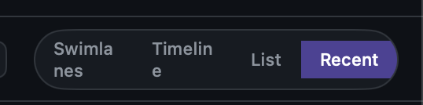
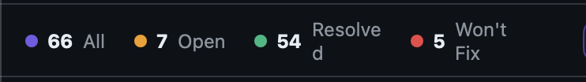

# 0066 — View-mode segment labels wrap when the window narrows

| | |
|---|---|
| **Status** | resolved |
| **Module** | Views |
| **Platform** | macOS |
| **First seen** | 2026-05-06 |
| **Closed** | 2026-05-06 |
| **Commit** | 81776b0 |
| **Commit (round 2)** | c538069 |

## Description

The four view-mode segments in `StatsBarViewModeSwitcherView` (Swimlanes / Timeline / List / Recent) wrap their labels onto two lines when the window width gets squeezed. "Swimlanes" splits as "Swimla / nes" and "Timeline" as "Timelin / e" — the segment label text should never wrap.

## Steps to reproduce

1. Open Issues.app on a folder with at least one issue.
2. Drag the right edge of the window inward to reduce the window width.
3. Watch the view-mode segmented control in the stats bar.

## Expected behavior

Each segment renders its label on a single line. When horizontal space runs out, the segments should shrink (truncate, scroll, or compress padding) — but the label text itself shouldn't wrap.

## Actual behavior

"Swimlanes" wraps to "Swimla / nes"; "Timeline" wraps to "Timelin / e". "List" and "Recent" remain on one line.

## Attachments

## Notes

Likely fix: add `.lineLimit(1)` (and possibly `.fixedSize(horizontal: true, vertical: false)`) to the segment label `Text` in `StatsBarViewModeSwitcherView.swift`. If single-line + fixed size makes the control overflow horizontally, consider clipping the trailing segments or compressing padding before allowing wrap.

## Root cause

`StatsBarViewModeSwitcherView` rendered each segment with a plain `Text(mode.displayName)` and no line-limit constraint. When the host stats bar got squeezed horizontally, SwiftUI's default text-layout behavior preferred wrapping the longer labels ("Swimlanes", "Timeline") onto a second line over truncating or shrinking the segments — producing the "Swimla / nes" and "Timelin / e" splits visible in the screenshot.

## Fix

Pinned the segment label `Text` to a single line with `.lineLimit(1)`, set `.truncationMode(.tail)` so any future overflow ellipsizes rather than wraps, and added `.fixedSize(horizontal: true, vertical: false)` so the label drives the segment's intrinsic width instead of the parent compressing it. The capsule control now keeps its natural width and overflows the available space if necessary, but the labels themselves never break across lines.

## Files changed

- `Issues/Views/StatsBarViewModeSwitcherView.swift` — three modifiers added to the segment label `Text`.

## Gotchas

- `.fixedSize(horizontal: true, …)` means the control will refuse to compress horizontally; if a future stats-bar layout depends on the switcher shrinking, the trade-off shifts toward dropping `.fixedSize` and relying on `.lineLimit(1) + .truncationMode(.tail)` alone (labels would then truncate with an ellipsis instead of staying full-width).

## Round 2 (2026-05-06)

Round 1 (commit `81776b0`) only patched `StatsBarViewModeSwitcherView`. After running the rebuilt app the user reported the same wrapping bug on the status-count chips along the leading edge of the stats bar: "Resolved" wrapped to "Resolve / d" and "Won't Fix" wrapped to "Won't / Fix" once the window was narrowed.

### Round 2 root cause

`StatsBarStatRowView` renders each chip as `dot · count · label`, and both the count and label `Text`s had no line-limit / fixed-size constraints. Same SwiftUI layout default as the segment switcher: when the surrounding `HStack` ran out of horizontal room, the longer labels broke onto a second line instead of letting the row drive its intrinsic width.

### Round 2 fix

Apply the same three modifiers from round 1 to both `Text`s in `StatsBarStatRowView`:

- `.lineLimit(1)`
- `.truncationMode(.tail)`
- `.fixedSize(horizontal: true, vertical: false)`

The count `Text` is already short ("12", "126") so it wouldn't wrap on its own, but pinning it matches the label's behavior and removes any future risk if counts ever grow longer.

### Files changed (round 2)

- `Issues/Views/StatsBarStatRowView.swift` — three modifiers added to both the count and label `Text`s.
