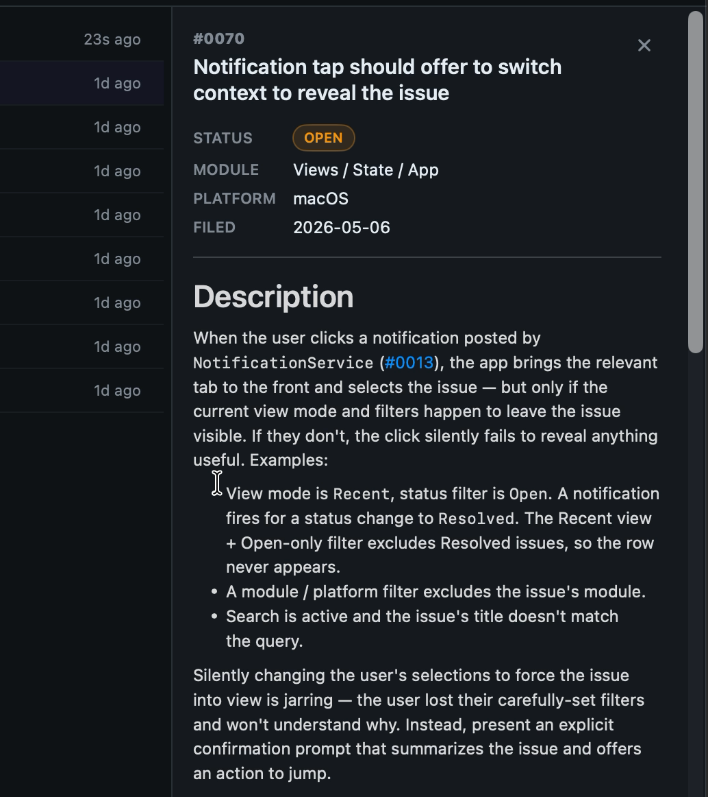

# 0072 — Detail panel markdown re-renders on every resize frame, causing visible jitter

| | |
|---|---|
| **Status** | open |
| **Module** | Views |
| **Platform** | macOS |
| **First seen** | 2026-05-07 |

## Description

Dragging the detail-panel resize handle (#0069) produces a heavy jitter in the rendered markdown body — text appears to flicker / re-flow on every frame of the drag rather than smoothly reflowing with the new width. The panel chrome itself moves smoothly; only the markdown content area jitters.

The likely cause is that the markdown rendering (Textual `MarkdownView` in `DetailPanelDescriptionView`) re-parses the source text on every body-rebuild as `panelWidth` changes during the drag. The content itself is not changing — only the available width — so the rendered output should be cached per `(issue.id, source-text)` and only re-laid-out on width change, not re-parsed.

## Steps to reproduce

1. Open Issues.app with a folder loaded.
2. Select an issue that has a meaningful description body (a few paragraphs is enough — the jitter is more visible with more text).
3. Grab the detail panel's leading-edge resize handle and drag it left/right continuously.
4. Watch the markdown body in the panel.

## Expected behavior

The markdown reflows smoothly as the panel width changes. Text wrapping updates per frame; glyphs do not flicker, jump, or re-position visibly within a line.

## Actual behavior

The text visibly jitters — characters/lines appear to redraw repeatedly, as if the markdown is being re-parsed and re-laid-out from scratch on every drag tick. The faster the drag, the more pronounced the flicker. Standalone evidence in the screen recording.

## Attachments

## Notes

- Suspected culprit: `DetailPanelDescriptionView` (and possibly `IssueMarkdownSheet` / `HelpView`, which also use Textual) building the `MarkdownView` inside `body` so SwiftUI tears it down and recreates it whenever any ancestor state changes — which now includes `panelWidth` from #0069.
- Cache strategy worth trying: hoist the parsed markdown (or the `MarkdownView` itself) into a memoized layer keyed by `(issue.id, descriptionText)`, so width changes only re-run layout against the already-parsed content. `Equatable` view conformance on the description subview, or `EquatableView { … }`, may be enough to short-circuit the rebuild.
- Another angle: confirm whether Textual's `MarkdownView` itself does its own caching of the parsed AST, and whether the resize is invalidating something it shouldn't (e.g. a `@State` inside the package). If so, the fix is on the consumer side regardless — keep the same `MarkdownView` instance across width changes.
- Pairs with #0069 (the resize handle that exposed this). Not strictly a regression — the panel was previously content-sized so its width never changed, so the path was never exercised. Now that resize is a routine action, the cost is visible.
