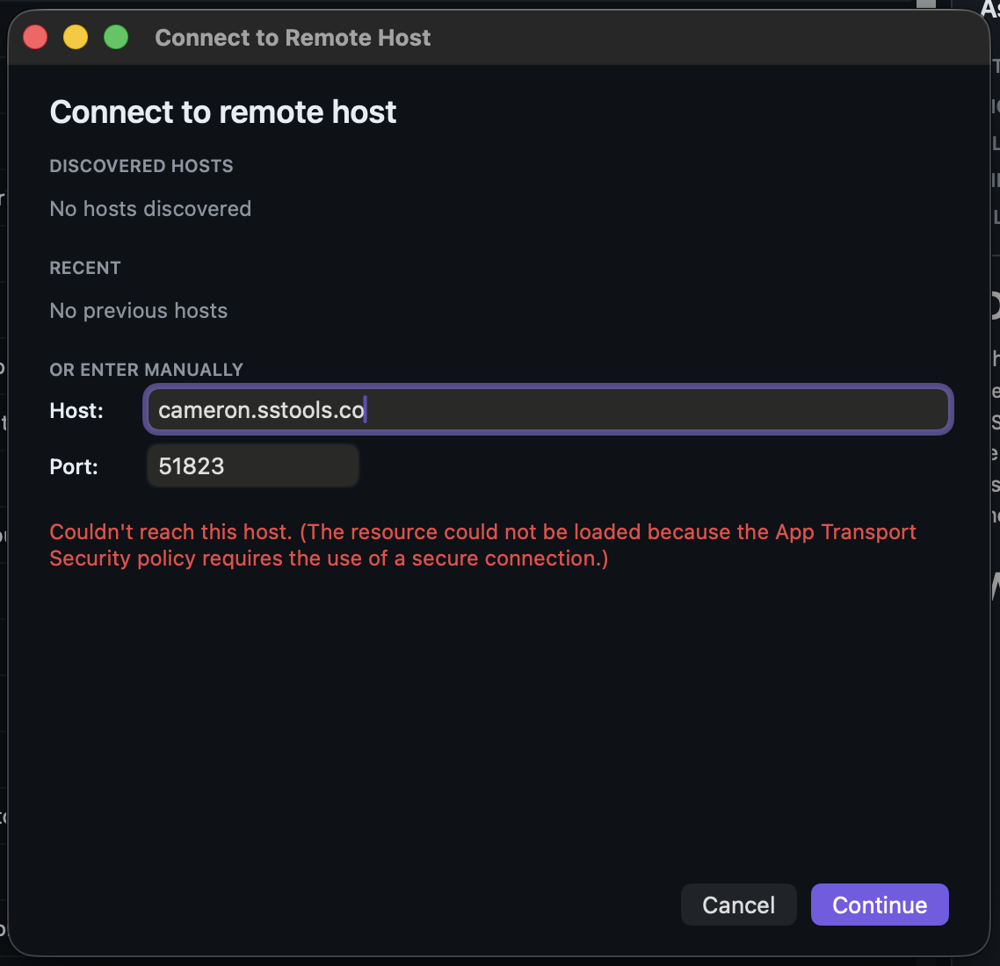

# 0110 — Remote-host viewer connection fails because App Transport Security blocks plain HTTP

| | |
|---|---|
| **Status** | resolved |
| **Module** | Build / Services |
| **Platform** | macOS |
| **First seen** | 2026-05-11 |
| **Closed** | 2026-05-11 |
| **Commit** | 589cf99 |

## Description

Connecting to a remote host from the viewer (the "Connect to Remote Host" sheet, #0091/#0096) fails before the bearer-token validation round-trip even fires:

> Couldn't reach this host. (The resource could not be loaded because the App Transport Security policy requires the use of a secure connection.)

The viewer uses `URLSession` against `http://<host>:<port>/…` (plain HTTP — TLS is explicitly out of v1 per `RemoteAccess.md`). macOS App Transport Security (ATS) is on by default and blocks plain-HTTP loads unless the app declares an exception in its Info.plist. Right now the app declares none, so every HTTP request fails at the URLSession layer regardless of whether the host is actually reachable.

This is a regression in *function*, not in code — the design always intended HTTP-on-LAN/Tailscale, but ATS wasn't accounted for in the Info.plist setup.

## Steps to reproduce

1. Enable hosting on the host Mac (host settings → enable toggle).
2. On the viewer Mac, open the folder picker and choose "Connect to remote host…".
3. Enter the host's address and port in the manual `host:port` field.
4. Click Continue.

## Expected behavior

The viewer connects to the host, validates the token, and advances to the folder picker. (Possibly after the user accepts a one-time ATS exception prompt, but at a minimum the URLSession call has to actually reach the host.)

## Actual behavior

URLSession returns the ATS error immediately, with no network traffic leaving the device. The inline error in the picker reads `Couldn't reach this host. (The resource could not be loaded because the App Transport Security policy requires the use of a secure connection.)`.

## Attachments



## Where to look

- **`Issues.xcodeproj/project.pbxproj`** — the Issues target has `GENERATE_INFOPLIST_FILE = YES` and a handful of `INFOPLIST_KEY_*` build settings (line ~419 / ~452 for Debug / Release). ATS needs an `NSAppTransportSecurity` dictionary in the generated Info.plist.
- **`Issues/Remote/RemoteClient.swift`** — for context only; no source change needed. The URL scheme is `http://` as the design intended.

## Fix options

ATS dict values aren't simple strings, so `INFOPLIST_KEY_NSAppTransportSecurity = …` isn't the natural fit. Three viable paths, in order of preference:

1. **`NSAllowsLocalNetworking = true` only** (narrowest). Covers `.local` hostnames, link-local addresses, and RFC1918 private IPv4. Sufficient for home/office LAN. **Does not cover Tailscale CGNAT (`100.64.0.0/10`)** — viewers on Tailscale would still hit the error. Probably wrong for v1 since the design targets Tailscale explicitly.
2. **`NSAllowsArbitraryLoads = true`** (broadest). Disables ATS for the app entirely. The auth boundary (bearer tokens) is independent of ATS; Tailscale already provides channel encryption over its tunnel. For a single-user developer tool, this is the pragmatic choice.
3. **Hybrid**: `NSAllowsArbitraryLoads = true` + `NSAllowsArbitraryLoadsInWebContent = false`. Allows plain HTTP for `URLSession` while keeping any future webviews under ATS. Marginal benefit unless we add web content later.

**Recommendation: option 2** for v1. Add a Note in `RemoteAccess.md` calling out that ATS is intentionally disabled and that v2 may add self-signed TLS with Keychain-pinned certificates per the existing design draft.

### Implementing the plist change

Two sub-options for delivering the `NSAppTransportSecurity` dict:

- **A. Keep `GENERATE_INFOPLIST_FILE = YES`** and inject via a Run Script build phase using `/usr/libexec/PlistBuddy` on the generated `Info.plist` in the build output directory. Fragile — runs after Xcode generates, has to find the right path, breaks if Xcode changes the generation timing.
- **B. Switch to an explicit `Info.plist`** for the Issues target (`GENERATE_INFOPLIST_FILE = NO`, `INFOPLIST_FILE = Issues/Info.plist`). Migrate the current `INFOPLIST_KEY_*` entries (`NSHumanReadableCopyright` is the only non-empty one today; `NSBonjourServices` will land later when #0093 unblocks). Then add `NSAppTransportSecurity` as a normal plist key. One-time migration, durable.

**Recommendation: option B.** It cleans up the path for future plist work (Bonjour, future TLS) and removes the auto-generation fragility.

### Concrete plist diff (for option B)

```xml
<key>NSAppTransportSecurity</key>
<dict>
    <key>NSAllowsArbitraryLoads</key>
    <true/>
</dict>
```

Plus a brief comment in the plist (XML `<!-- … -->`) explaining why — future-me will wonder.

## Verification

- After applying, repeat the steps to reproduce. The viewer's manual `host:port` Continue:
  - 401 from the host (no token sent yet) → picker advances to the token paste step (#0096). This is the expected "reachable, awaiting token" path.
  - Wrong port / unreachable → inline "couldn't reach this host" without the ATS phrase. Connection error is fine; ATS error is not.
- Verify the entire `RemoteClient` HTTP surface still works against a host on `http://`: `/v1/host`, `/v1/folders`, `/v1/folders/{id}/issues`, the attachment streaming endpoint, and the WebSocket upgrade (`ws://`).
- Verify on Tailscale specifically: a host whose address is in `100.64.0.0/10` should connect. (This is what motivates option 2 over option 1.)
- Ensure no regression in any other URLSession path (the build cycle hits no other `http://` URLs today, but worth a sanity check).
- Tests pass: `xcodebuild -project Issues.xcodeproj -scheme Issues -destination 'platform=macOS' test`.

## Notes

- ATS is a *channel-encryption* guarantee; the remote-access design's *authentication* guarantee comes from bearer tokens hashed at rest (#0078). The two are orthogonal — disabling ATS doesn't weaken auth. Anyone reading the wire would still see encrypted-by-Tailscale bytes (over Tailscale) or plaintext bytes including the bearer (over a local LAN you trust).
- If we ever add TLS (self-signed, pinned via Keychain — `RemoteAccess.md` mentions this as a v2 option), ATS can be re-enabled fully. That's the natural place to un-do this exception.
- This is the first ATS-relevant code we've shipped in this app. Once option B lands, the explicit Info.plist becomes the canonical place to wire `NSBonjourServices` (currently slated for #0093 once the multicast entitlement comes through). Worth mentioning in #0093's Files-changed list when it eventually resolves.

## Scope (out)

- Adding TLS to v1 — `RemoteAccess.md` line 70 keeps it out of scope. Revisit in v2.
- Per-host ATS exception lists. Too much UX for a single-user tool.
- Migrating tests off the local file-source path — unaffected by this change.

## Root cause

App Transport Security defaulted on with no exception declared. The `URLSession` calls to `http://<host>:<port>` were rejected at the framework layer before any network traffic left the device, so the viewer's "Continue" button on the manual host:port field always surfaced the ATS error string.

## Fix

Option B + option 2 per the spec:

- **Switch the Issues target from `GENERATE_INFOPLIST_FILE = YES` to an explicit `Info.plist`** at the repo root. The plist uses `$(BUILD_SETTING)` substitutions (`PRODUCT_BUNDLE_IDENTIFIER`, `EXECUTABLE_NAME`, `MARKETING_VERSION`, etc.) so the migration is structurally neutral except for the new ATS dict; Xcode's `builtin-infoPlistUtility` still merges remaining `INFOPLIST_KEY_*` settings into it at build time.
- **Add the `NSAppTransportSecurity` dict** with `NSAllowsArbitraryLoads = true`. Picked option 2 over option 1 because Tailscale's CGNAT range (`100.64.0.0/10`) isn't covered by `NSAllowsLocalNetworking`, and Tailscale is an explicit design target.

The plist lives at the repo root, not inside `Issues/`, because the `PBXFileSystemSynchronizedRootGroup` for that folder auto-adds every file to the target's Copy Bundle Resources phase — including the Info.plist itself, which conflicted with its use as the target's plist and crashed the test runner on launch. Moving it outside the synchronized group sidesteps the auto-add entirely.

Verified: the merged Info.plist in the built `.app` contains all the expected `CFBundle*` keys plus the ATS dict; the full unit suite is green.

## Files changed

- `Info.plist` — new. The explicit plist with build-setting substitutions + the ATS dict.
- `Issues.xcodeproj/project.pbxproj` — `GENERATE_INFOPLIST_FILE = NO` + `INFOPLIST_FILE = Info.plist` for both Debug and Release configs of the Issues target. Other targets (IssuesTests, IssuesUITests, Watcher, etc.) keep `GENERATE_INFOPLIST_FILE = YES`.

## Gotchas

- **Don't put the Info.plist inside `Issues/`.** The synchronized root group auto-adds it to Copy Bundle Resources, which fights its use as the target's Info.plist. The test runner crashes on launch with `The test runner crashed before establishing connection`. Repo root is the obvious place out of the way.
- **`$(BUILD_SETTING)` substitutions are processed at build time** by `builtin-infoPlistUtility`. Don't write literal values for things like `PRODUCT_BUNDLE_IDENTIFIER` — they'll drift the next time the build setting changes.
- **`INFOPLIST_KEY_*` build settings still merge into the explicit plist.** Keeping `INFOPLIST_KEY_NSHumanReadableCopyright = ""` in the pbxproj is harmless and means there's only one place a future copyright string change needs to happen.
- **This is the v1 bridge.** When #0114 (TLS + cert pinning) lands, the `NSAppTransportSecurity` dict is removed from this file (cert pinning via `URLSessionDelegate` bypasses ATS's chain check cleanly). The Info.plist itself stays — it's where `NSBonjourServices` will land when #0093 unblocks, and where any future plist-only keys land.
- **Per `RemoteAccess.md` line 70**, TLS is intentionally out of v1 scope. The token model is the *authentication* boundary; ATS is a *channel* guarantee. Disabling ATS doesn't weaken auth — anyone reading the wire on a trusted LAN sees plaintext that includes the bearer, but the host validates every request against the hashed token database (#0078).
