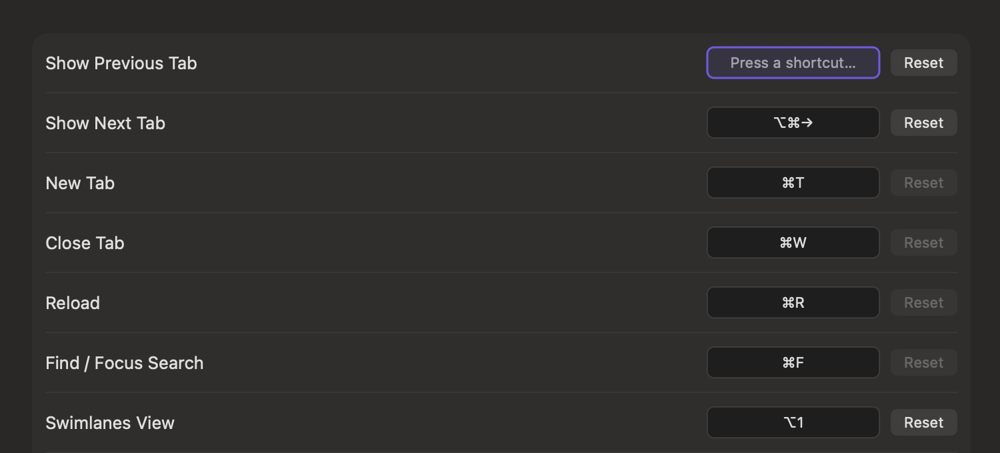
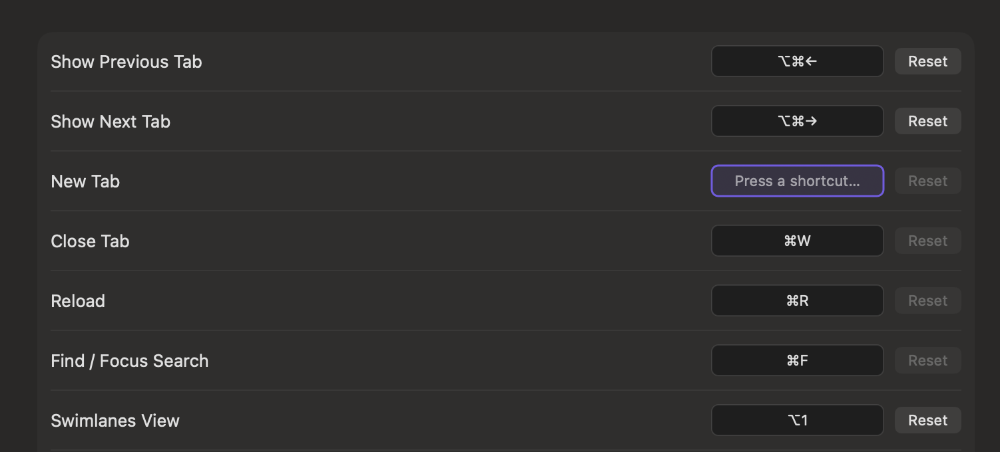

# 0117 — Recorder hides the current shortcut while it's being recorded

| | |
|---|---|
| **Status** | resolved |
| **Module** | Views |
| **Platform** | macOS |
| **First seen** | 2026-05-11 |
| **Closed** | 2026-05-11 |
| **Commit** | 54af2ab |

## Description

When the user clicks a shortcut recorder in Settings → Shortcuts to change a binding, the field replaces the existing binding with the placeholder text `Press a shortcut…`. The currently-assigned combo disappears from view while the user decides what to bind. That's confusing: the user can no longer see *what they're about to overwrite*, so unless they remember the previous binding, they can't tell whether they're happy with it, or compare alternatives.

The two screenshots below show the issue: in the first, the user has focused **Show Previous Tab**'s recorder. The other rows clearly show their bindings (`⌥⌘→`, `⌘T`, `⌘W`, `⌘R`, `⌘F`, `⌥1`), but the focused row reads `Press a shortcut…` with no hint that it's currently bound to `⌥⌘←`. Same pattern for the second screenshot focusing **New Tab**.

## Steps to reproduce

1. `⌘,` to open Settings → Shortcuts.
2. Click any row's recorder field. The field tints purple (the accent-colored focus ring) and the text becomes `Press a shortcut…`.

## Expected behavior

While the recorder is focused/recording, the **current binding stays visible** so the user can:
- See what they're replacing.
- Decide to Esc out without changing if the existing combo turned out to be the one they wanted after all.
- Compare it visually against neighboring rows.

The accent-colored focus ring is already the load-bearing visual cue that recording is active; the text label can carry the current binding instead of the placeholder.

## Actual behavior

The text label is replaced by `Press a shortcut…` in `secondaryLabelColor`. The current binding is invisible until the user presses Esc, blurs the field, or commits a new combo.

## Attachments




## Where to look

- **`Issues/Views/Settings/RecorderView.swift`** — the AppKit `draw(_:)` method picks the label by state:

  ```swift
  if isRecording {
      label = "Press a shortcut…"
      color = NSColor.secondaryLabelColor
  } else if binding.key.isEmpty {
      label = "Click to record"
      color = NSColor.tertiaryLabelColor
  } else {
      label = binding.displayString
      color = NSColor.labelColor
  }
  ```

  The first branch unconditionally replaces the binding with the placeholder. That's what we want to change.

## Fix

Re-order so the **binding wins** while recording, with the placeholder reserved for the empty-binding case. Specifically:

```swift
if isRecording {
    if binding.key.isEmpty {
        label = "Press a shortcut…"
        color = NSColor.secondaryLabelColor
    } else {
        label = binding.displayString
        color = NSColor.secondaryLabelColor  // muted to signal "about to change"
    }
} else if binding.key.isEmpty {
    label = "Click to record"
    color = NSColor.tertiaryLabelColor
} else {
    label = binding.displayString
    color = NSColor.labelColor
}
```

- The recording state still has a visually distinct treatment: the **purple focus ring + tinted background** stay; the text drops to `secondaryLabelColor` so the binding looks "ghosted" (pending replacement) rather than "current." The accent ring is the active indicator.
- The first-time / never-bound case keeps `Press a shortcut…` as the placeholder so the user isn't confronted with a blank field that does nothing visible when clicked.

This is one self-contained change to `draw(_:)`. No other view code, no state, no API change.

## Verification

- Open Settings → Shortcuts. Each row shows its current binding in normal weight.
- Click a row's recorder. The purple ring appears; the row continues to show its current binding, just in muted gray. No `Press a shortcut…` text.
- Esc → ring goes away, text returns to normal weight. Same binding (no change).
- Click again, press a new combo → binding updates, ring goes away, text shows the new combo.
- Reset on a row brings the binding back to its default; clicking that row's recorder still shows the default in muted gray (not `Press a shortcut…`).
- For an action where the persisted binding decoded to empty (corruption / future-compat fallthrough), clicking the recorder shows the placeholder `Press a shortcut…` — that's the one and only context where the placeholder still appears.

## Notes

- The accent-colored ring is the only purely visual indicator of "recording" mode, but it's prominent enough (and matches Apple's recording-style affordance in System Settings). No additional label hint needed.
- Using `secondaryLabelColor` for the muted binding matches the existing `Press a shortcut…` color — same visual weight, just a different glyph.
- If we later want a separate "(recording)" caption beneath the row, that's a follow-up; for v1 of this fix the muted-binding-in-place is enough.

## Scope (out)

- Animation between idle / recording states.
- A separate "currently bound" label outside the recorder field.
- Changing the behavior of `Esc` (still cancels, doesn't clear).
- Changes to the `Reset` button placement or behaviour.

## Root cause

`RecorderView.draw(_:)` had three branches: `isRecording`, empty-binding, has-binding. The `isRecording` branch unconditionally replaced the label with `Press a shortcut…`, treating "is recording" as if it always meant "is currently empty about to receive new value." It didn't account for the common case where the user is *changing* an existing binding and wants to see what they're replacing.

## Fix

Split the `isRecording` branch into two sub-cases:

- **Recording + empty binding** → `Press a shortcut…` (existing placeholder, unchanged).
- **Recording + has binding** → render the binding's glyph string in `secondaryLabelColor` (muted gray). This is the new behaviour.

The accent-colored focus ring and tinted background already render distinctly when `isRecording` is true; the label's muted color signals "pending replacement" without occluding the actual binding.

## Files changed

- `Issues/Views/Settings/RecorderView.swift` — `draw(_:)` label-pick block split into recording-with-binding vs recording-without-binding cases. Comment cites #0117 for the rationale.

## Gotchas

- **Don't bump the color back to `labelColor` while recording.** The muted gray is what tells the user "this is the *current* value, not the new one." Full-strength label color would be confused with a freshly-committed binding.
- **The empty-binding-while-recording case is mostly theoretical** — `ShortcutAction` defaults populate every action on first load, and Reset restores the default — but it's still the right behaviour for a corruption-recovery path or future actions that ship without defaults.
- **No animation between states.** SwiftUI's animation modifiers don't help here because the label is drawn directly in `NSView.draw(_:)`. A future improvement could cross-fade, but it's not worth the complexity for v1.
